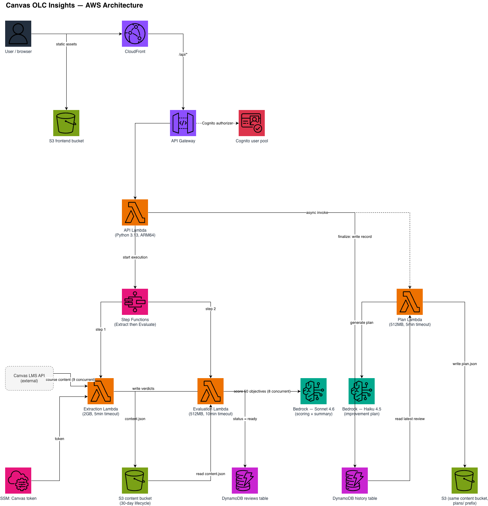

# Canvas OLC Insights

| Index                         | Description                                         |
|:------------------------------|:----------------------------------------------------|
| [Overview](#overview)                   | See what this project does and its key capabilities |
| [Demo](#demo)                           | View the demo video                                 |
| [Description](#description)             | Learn about the problem and our approach            |
| [Scorecard Structure](#scorecard-structure) | How the 50 objectives are organized and scored  |
| [Architecture](#architecture)           | View the system architecture diagram                |
| [Tech Stack](#tech-stack)               | Technologies and services used                      |
| [Security](#security)                   | Authentication, authorization, and data protection  |
| [Deployment](#deployment)               | How to install and deploy the solution              |
| [Usage](#usage)                         | How to use the application                          |
| [Costs](#costs)                         | Estimated AWS costs for running the solution        |
| [Troubleshooting](#troubleshooting)     | Common issues and solutions                         |
| [Credits](#credits)                     | Meet the team behind this project                   |
| [License](#license)                     | See the project's license information               |
| [Disclaimers](#disclaimers)             | Important legal disclaimers                         |

---

# Overview

**Canvas OLC Insights** is a serverless AI-powered course quality review platform designed to help instructional designers and faculty evaluate online courses against **50 quality objectives derived from the publicly available OLC (Online Learning Consortium) Course Review Scorecard**. The solution leverages AWS Bedrock (Claude Sonnet 4.6) and the Canvas LMS API to automate the evaluation of these objectives, reducing a multi-hour manual review process to around 3 minutes.

**Key capabilities include:**

- **Automated Course Extraction**: Retrieves all course content (modules, pages, assignments, discussions, files, syllabus) from Canvas LMS via API and extracts text from PDFs, DOCX, and PPTX files
- **AI-Powered Scoring**: Evaluates all 50 objectives using Claude Sonnet 4.6 with structured output, producing criteria-level verdicts and rationale for each standard
- **Human-in-the-Loop Workspace**: Presents AI-proposed scores for human review and confirmation; objectives not judgeable from static content are automatically flagged for human evaluation
- **Improvement Plan Generation**: After finalization, generates actionable recommendations using Claude Haiku 4.5 targeting objectives scored below Exemplary
- **Historical Analytics**: Tracks course scores over time with trend visualization, enabling institutions to measure improvement across review cycles

---

# Demo

https://github.com/user-attachments/assets/7583026c-b07e-4887-b119-fb02c2b78ee7

---

# Description

## Problem Statement

Evaluating online course quality against the OLC Scorecard's 50 objectives is a time-intensive process requiring reviewers to manually inspect every page, assignment, discussion, and file in a Canvas course — typically taking 2-4 hours per course. With hundreds of courses to review on a 1-1.5 year revision cycle, instructional design teams cannot scale manual reviews to meet demand. Courses go unreviewed, quality gaps persist, and faculty lack specific, actionable feedback on how to improve.

## Our Approach

### Extraction

A single Lambda retrieves the entire Canvas course content through parallel API calls — pages, assignments, quizzes, discussions, announcements, files, and the syllabus — then follows in-content links to discover additional resources (like PDF attachments) that aren't directly listed in the module structure. PDFs, DOCX, and PPTX files are downloaded and parsed for full text. The Lambda also collects structural metadata (module counts, rubric coverage, due date distribution) for the dashboard and runs content quality checks: SSRF-protected link validation and spelling analysis.

### Evaluation

A second Lambda receives the extracted content and scores all 50 objectives in one invocation using bounded-concurrency async calls to Bedrock (Claude Sonnet 4.6). Each objective is evaluated against its accomplished and exemplary criteria, producing a structured verdict with per-criterion judgments, evidence, confidence level, and improvement suggestions. The model also determines at runtime whether each objective is judgeable from static course content — objectives that require live observation or instructor interaction are flagged for human review rather than guessed at. Scores are never taken from the model directly; they are deterministically recomputed from the individual criterion verdicts. After scoring, the Lambda generates a course quality summary and a subject-area overview.

### Serverless Pipeline

The backend runs on AWS Lambda (Python 3.13, ARM64) orchestrated by a 2-step Step Function: Extract → Evaluate. Four self-contained Lambdas (Extraction, Evaluation, API, Improvement Plan) share no code — each contains everything it needs. The architecture scales to zero when idle and handles burst workloads without provisioning.

### React Dashboard

A React 19 + TypeScript frontend provides the reviewer workspace: a scorecard dashboard with section-level scores, per-objective detail views for human review and score confirmation, PDF export of finalized scorecards, and a time-series metrics dashboard showing improvement trends across review cycles.

---

# Scorecard Structure

The OLC-derived scorecard organizes 50 course quality objectives into three sections:

| Section | Objectives | Focus |
|:--------|:-----------|:------|
| **Essential Design** | E1–E20 (20) | Course overview, learning objectives, assessment alignment, accessibility, technology |
| **Advanced Design** | A1–A15 (15) | Learner engagement, collaboration, multimedia, instructor presence |
| **Course Delivery** | D1–D15 (15) | Communication, feedback timeliness, participation, learner support |

Each objective is scored on a 3-point scale: **0** (Developing), **1** (Accomplished), or **2** (Exemplary) — for a maximum score of **100 points**. All 50 objectives are evaluated by AI; objectives that cannot be judged from static course content (e.g., those requiring live instructor observation) are automatically flagged for human review.

---

# Architecture



---

# Tech Stack

| Category | Technology | Purpose |
|:---------|:-----------|:--------|
| **Amazon Web Services** | [Lambda](https://aws.amazon.com/lambda/) | 4 Python functions (API, Extraction, Evaluation, Plan) |
| | [Step Functions](https://aws.amazon.com/step-functions/) | Orchestrates 2-step Extract → Evaluate pipeline |
| | [Bedrock](https://aws.amazon.com/bedrock/) | Claude Sonnet 4.6 for scoring/summary, Haiku 4.5 for plans |
| | [DynamoDB](https://aws.amazon.com/dynamodb/) | Review sessions + permanent course history |
| | [S3](https://aws.amazon.com/s3/) | Content storage, verdict JSONs, PDFs, frontend hosting |
| | [API Gateway](https://aws.amazon.com/api-gateway/) | REST API with Cognito authorization |
| | [Cognito](https://aws.amazon.com/cognito/) | User authentication (email/password) |
| | [CloudFront](https://aws.amazon.com/cloudfront/) | CDN for frontend + API passthrough |
| | [CDK](https://aws.amazon.com/cdk/) | Infrastructure as code (TypeScript) |
| **Backend** | [Python 3.13](https://www.python.org/) | Lambda runtime (ARM64/Graviton) |
| | [PydanticAI](https://ai.pydantic.dev/) | Structured AI output with Bedrock integration |
| | [pdfplumber](https://github.com/jsvine/pdfplumber) | PDF text extraction |
| | [python-docx](https://python-docx.readthedocs.io/) | DOCX text extraction |
| | [python-pptx](https://python-pptx.readthedocs.io/) | PPTX text extraction |
| **Frontend** | [React 19](https://react.dev/) | UI framework |
| | [TypeScript](https://www.typescriptlang.org/) | Type safety |
| | [Vite](https://vite.dev/) | Build tool and dev server |
| | [Tailwind CSS 4](https://tailwindcss.com/) | Utility-first styling |
| | [Zustand](https://zustand-demo.pmnd.rs/) | State management with sessionStorage persistence |
| | [React Query](https://tanstack.com/query) | Data fetching and caching |

---

# Security

- **Authentication**: Cognito authorizer on all API Gateway routes — unauthenticated requests are rejected
- **Canvas API authorization**: Authorization is enforced by the Canvas API token's own grant within Canvas LMS — the application can access any course/account the token has permission to see. A scope guard validates that API calls match expected Canvas endpoint patterns (16 regex patterns) to catch programming errors before they reach the network, but this is not an authorization mechanism
- **SSRF protection**: Content quality link checker validates URLs against private IP ranges before making requests
- **Resource constraints**: File downloads are limited by Lambda memory (2 GB) and timeout (5 minutes); the system attempts to download all files referenced in course content with no explicit size or count restrictions
- **Data lifecycle**: 30-day S3 lifecycle policy on review content; no indefinite data retention
- **S3 access control**: Frontend and content buckets block all public access; CloudFront uses Origin Access Control
- **Secrets management**: Canvas API token stored in SSM SecureString, fetched at runtime — never in CloudFormation templates or environment variables

---

# Deployment

## Prerequisites

1. An [AWS account](https://signin.aws.amazon.com/signup?request_type=register)
2. **Node.js 18+** — [Download here](https://nodejs.org/) or use [nvm](https://github.com/nvm-sh/nvm)
3. **AWS CDK** — install via:
   ```bash
   npm install -g aws-cdk
   ```
4. **AWS CLI** — [Installation Guide](https://docs.aws.amazon.com/cli/latest/userguide/getting-started-install.html)
5. **Docker** — [Download here](https://www.docker.com/get-started/) (required for Lambda bundling)
6. **Python 3.13** — [Download here](https://www.python.org/downloads/)
7. A **Canvas LMS API token** with access to the courses you want to review
8. **Post-deployment**: Access to AWS Console for creating Cognito users (or AWS CLI credentials)

## AWS Configuration

1. **Configure AWS credentials:**
   ```bash
   aws configure --profile your-profile
   ```

2. **Store Canvas API token in SSM:**
   
   The Canvas API token is stored in AWS Systems Manager Parameter Store:
   
   ```bash
   aws ssm put-parameter \
     --name "/qa-bot/canvas-api-token" \
     --value "YOUR_CANVAS_TOKEN" \
     --type SecureString \
     --region us-east-1 \
     --profile your-profile
   ```
   
   **Important**: This must be set BEFORE running any course reviews, or the Extraction Lambda will fail.

3. **Bootstrap CDK** (required once per AWS account/region):
   ```bash
   cdk bootstrap aws://ACCOUNT_ID/us-east-1
   ```

## Deployment

1. **Clone the repository:**
   ```bash
   git clone https://github.com/pitt-cic/Canvas-OLC-Insights-Public.git
   cd Canvas-OLC-Insights
   ```

2. **Deploy infrastructure:**
   ```bash
   cd infra
   npm install
   export CANVAS_BASE_URL="https://your-canvas-instance.instructure.com"
   npx cdk deploy --profile your-profile
   ```

3. **Build and deploy frontend:**
   ```bash
   cd ../frontend
   npm install
   npm run build
   aws s3 sync dist/ s3://FRONTEND_BUCKET_NAME --profile your-profile
   ```

   The frontend bucket name and CloudFront URL are printed in CDK outputs after deploy.

## Post-Deployment Configuration

After `cdk deploy` completes, you'll see 6 outputs. Save these values - you'll need them to configure the frontend.

### Step 1: Note CDK Outputs

The deployment outputs will look like:
```
✅  Canvas-OLC-Insights-Stack

Outputs:
Canvas-OLC-Insights-Stack.UserPoolId = us-east-1_XXXXXXXXX
Canvas-OLC-Insights-Stack.UserPoolClientId = 26charlongstringhere
Canvas-OLC-Insights-Stack.ApiUrl = https://xxxxx.execute-api.us-east-1.amazonaws.com/prod
Canvas-OLC-Insights-Stack.CloudFrontUrl = https://dxxxxx.cloudfront.net
Canvas-OLC-Insights-Stack.FrontendBucketName = canvas-olc-insights-frontend-xxxxx-us-east-1
Canvas-OLC-Insights-Stack.CognitoHostedUiUrl = https://canvas-olc-insights-xxxxx.auth.us-east-1.amazoncognito.com
```

Copy these values for the next steps.

### Step 2: Configure Frontend Environment

**For Production Builds** (deployed to S3):

1. Update `frontend/.env` with your deployment values:
   ```bash
   cd frontend
   cp .env.example .env
   ```

2. Edit `frontend/.env`:
   ```env
   VITE_USER_POOL_ID=us-east-1_XXXXXXXXX         # From UserPoolId output
   VITE_USER_POOL_CLIENT_ID=your-client-id-here  # From UserPoolClientId output
   VITE_AWS_REGION=us-east-1                     # Your AWS region
   VITE_API_URL=                                 # Leave empty (not used in production)
   VITE_CLOUDFRONT_URL=                          # Leave empty (not used in production)
   ```

   **Important**: Only `VITE_USER_POOL_ID` and `VITE_USER_POOL_CLIENT_ID` are actively used by the application for Cognito authentication.

3. Rebuild and redeploy frontend:
   ```bash
   npm run build
   cd ../infra
   cdk deploy --profile your-profile
   ```

The CDK stack will automatically sync the new build to S3 and invalidate CloudFront cache.

**For Local Development**:

Use the same `.env` file, but Vite will proxy API requests to `localhost:8000` automatically.

### Step 3: Create Your First Cognito User

Self-signup is disabled for security. Create users manually via AWS Console:

1. Go to **AWS Console** → **Cognito** → **User Pools**
2. Select the pool starting with `canvas-olc-insights-userpool-`
3. Click **Users** → **Create user**
4. Configure:
   - **Email address**: User's email (this is their username)
   - **Temporary password**: Set a temporary password
   - **Email verified**: Check "Mark email address as verified"
   - **Invitation message**: Uncheck "Send an email invitation"
5. Click **Create user**

The user will be required to change their password on first login.

**Alternative: AWS CLI**
```bash
aws cognito-idp admin-create-user \
  --user-pool-id us-east-1_XXXXXXXXX \
  --username user@example.com \
  --user-attributes Name=email,Value=user@example.com Name=email_verified,Value=true \
  --temporary-password TempPassword123! \
  --message-action SUPPRESS \
  --profile your-profile
```

### Step 4: Verify Deployment

1. Navigate to the **CloudFront URL** from your outputs
2. Click "Log In"
3. Sign in with the email and temporary password
4. Set a new permanent password when prompted
5. You should see the "Select Canvas Account" screen

If login fails:
- Verify User Pool ID and Client ID in `frontend/.env` are correct
- Ensure frontend was rebuilt after updating `.env`
- Check that email is marked as verified in Cognito console

## Local Development

```bash
cd frontend
npm install
cp .env.example .env
# Edit .env with your Cognito User Pool ID, Client ID, API URL, and region
# (these values come from your CDK stack outputs after deploying infra)
npm run dev
```

---

# Usage

1. **Access the Application** — Navigate to the CloudFront URL from CDK outputs
2. **Log In** — Sign in with your Cognito credentials (email/password)
3. **Select a Course** — Browse the course list (pulled from Canvas API based on your token's access) and select a course to review
4. **Choose an Action**:
   - **File New Review** — Starts the automated extraction and scoring pipeline (~2-3 minutes)
   - **View Metrics** — See historical score trends for this course
5. **Review Scores** — Once processing completes, the dashboard shows AI-proposed scores for all 50 objectives. Review each one, confirm or adjust scores, and provide human scoring for any objectives flagged for human review
6. **Finalize** — Lock in scores, which saves the scorecard to permanent history and generates a PDF
7. **Generate Improvement Plan** — After finalization, trigger AI-generated recommendations for any objectives scored below Exemplary

---

# Costs

## Per-Run Cost

| Course Size | Cost/Run | Description |
|:------------|:---------|:------------|
| **Small** | ~$0.80 | 3-5 modules, short syllabus, few pages, ~10 assignments |
| **Medium** | ~$1.20 | 8-12 modules, detailed syllabus, 15-30 pages, ~25 assignments |
| **Large** | ~$1.67 | 15+ modules, long syllabus, 50+ pages, 40+ assignments, PDFs |

## Cost Breakdown

| Component | % of Total | Detail |
|:----------|:-----------|:-------|
| Scoring (50x Sonnet 4.6) | ~96% | Dominant cost driver |
| Summary (2x Sonnet 4.6) | ~2% | Course summary + overview |
| Plan (1x Haiku 4.5) | ~1.5% | Improvement recommendations |
| Infrastructure (Lambda, Step Functions, DynamoDB, S3) | ~0.4% | Negligible at any scale |

## Monthly Projections

| Courses/month | Estimated Cost |
|:--------------|:---------------|
| 10 | $8–$17 |
| 50 | $40–$84 |
| 100 | $80–$167 |
| 500 | $400–$835 |

Infrastructure baseline (idle) is effectively $0 — all services are pay-per-request with no provisioned capacity.

Cost scales primarily with content volume — longer syllabi, more pages, extracted PDFs, and detailed assignment descriptions increase token usage. All 50 objectives are scored in a single Evaluation Lambda invocation using Sonnet 4.6 with bounded concurrency (8 simultaneous Bedrock calls). Infrastructure costs are negligible.

> Cost estimates based on AWS Bedrock pricing as of August 2026. Prompt caching is enabled and may reduce actual costs by 10-20%.

---

# Troubleshooting

### "User does not exist" on login
- Verify user was created in Cognito User Pool
- Check that email is marked as verified
- Ensure you're using the email address as username (not a separate username)

### "Unable to verify secret hash for client"
- User Pool Client ID in `.env` is incorrect
- Rebuild frontend after updating `.env`: `npm run build && cd ../infra && cdk deploy --profile your-profile`

### API requests fail with 401 Unauthorized
- Cognito authentication may have expired - refresh the page
- Verify API Gateway has Cognito authorizer configured (should be automatic)

### "Invalid Canvas token" errors
- Canvas API token in SSM Parameter Store (`/qa-bot/canvas-api-token`) is missing or invalid
- Update with: `aws ssm put-parameter --name "/qa-bot/canvas-api-token" --value "new-token" --type SecureString --overwrite --profile your-profile`

### Frontend shows blank page after deployment
- Check CloudFront distribution is active (can take 5-10 minutes)
- Verify `frontend/dist/` was built before `cdk deploy`
- Clear browser cache and try in incognito mode

---

# Credits

**Canvas OLC Insights** is an open-source project developed by the Health Sciences and Sports Analytics Cloud Innovation Center at the University of Pittsburgh.

**Development Team:**

- **Student Developer**: [Avinash Kottakota](https://www.linkedin.com/in/avinash-kottakota/)

**Project Leadership:**

- **Technical Lead**: [Maciej Zukowski](https://www.linkedin.com/in/maciejzukowski/) - Solutions Architect, Amazon Web Services (AWS)
- **Program Manager**: [Kate Ulreich](https://www.linkedin.com/in/kate-ulreich-0a8902134/) - Program Leader, University of Pittsburgh Cloud Innovation Center
- **Program Manager**: [Dwigth Helfrich](https://www.linkedin.com/in/dwight-helfrich-53a233b/) - Program Leader, University of Pittsburgh Cloud Innovation Center
- **Program Manager**: [Varun P. Shelke](https://https://www.linkedin.com/in/vashelke/) - Program Leader, University of Pittsburgh Cloud Innovation Center

**Special Thanks**:

- [Rae Mancilla](https://www.edge.pitt.edu/people/rae-mancilla-edd) — Executive Director of University Digital Education
- This project is designed and developed with guidance and support from the [Cloud Innovation Center](https://digital.pitt.edu/cic), powered by AWS.

---

# License

This project is licensed under the [MIT License](./LICENSE).

```plaintext
MIT License

Copyright (c) 2026 University of Pittsburgh Health Sciences and Sports Analytics Cloud Innovation Center

Permission is hereby granted, free of charge, to any person obtaining a copy
of this software and associated documentation files (the "Software"), to deal
in the Software without restriction, including without limitation the rights
to use, copy, modify, merge, publish, distribute, sublicense, and/or sell
copies of the Software, and to permit persons to whom the Software is
furnished to do so, subject to the following conditions:

The above copyright notice and this permission notice shall be included in all
copies or substantial portions of the Software.

THE SOFTWARE IS PROVIDED "AS IS", WITHOUT WARRANTY OF ANY KIND, EXPRESS OR
IMPLIED, INCLUDING BUT NOT LIMITED TO THE WARRANTIES OF MERCHANTABILITY,
FITNESS FOR A PARTICULAR PURPOSE AND NONINFRINGEMENT. IN NO EVENT SHALL THE
AUTHORS OR COPYRIGHT HOLDERS BE LIABLE FOR ANY CLAIM, DAMAGES OR OTHER
LIABILITY, WHETHER IN AN ACTION OF CONTRACT, TORT OR OTHERWISE, ARISING FROM,
OUT OF OR IN CONNECTION WITH THE SOFTWARE OR THE USE OR OTHER DEALINGS IN THE
SOFTWARE.
```

---

# Scoring Criteria

This project's course-quality scoring criteria are independently derived from the publicly available [OLC Course Review Scorecard](https://onlinelearningconsortium.org/) — the objective list and scoring structure OLC distributes as a free, open-access tool. We do not use, reference, or reproduce OLC's proprietary **Handbook**, which contains OLC's own detailed interpretation guidance and is gated to OLC members/purchasers.

Institutions that are OLC members and have access to OLC's official Handbook are welcome to replace `backend/objectives.py` with their own criteria derived from it — the objectives dictionary structure (50 keys, same field names) is kept stable to support exactly this kind of drop-in swap.

---

# Disclaimers

**Customers are responsible for making their own independent assessment of the information in this document.**

**This document:**
(a) is for informational purposes only,
(b) references AWS product offerings and practices, which are subject to change without notice,
(c) does not create any commitments or assurances from AWS and its affiliates, suppliers or licensors. AWS products or
services are provided "as is" without warranties, representations, or conditions of any kind, whether express or
implied. The responsibilities and liabilities of AWS to its customers are controlled by AWS agreements, and this
document is not part of, nor does it modify, any agreement between AWS and its customers, and
(d) is not to be considered a recommendation or viewpoint of AWS.

**Additionally, you are solely responsible for testing, security and optimizing all code and assets on GitHub repo, and
all such code and assets should be considered:**
(a) as-is and without warranties or representations of any kind,
(b) not suitable for production environments, or on production or other critical data, and
(c) to include shortcuts in order to support rapid prototyping such as, but not limited to, relaxed authentication and
authorization and a lack of strict adherence to security best practices.

**All work produced is open source. More information can be found in the GitHub repo.**
